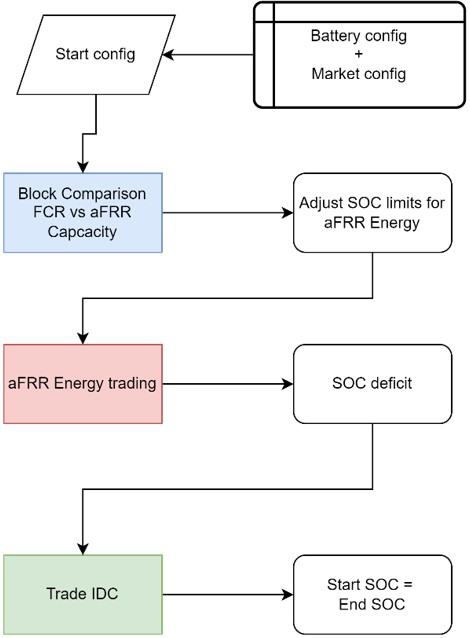

# Cross-market trading

With this approach, we present an indexing approach that mimics real trading while staying transparent and simple to understand its calculation. 

The following flowchart presents the methodology of the cross-market trading approach and how it’s considering the above-mentioned index characteristics.

The flowchart illustrates the trading steps for every trading day as well as the data sources for each block. We begin with an initialization of the battery and markets. Then, the algorithm compares the two ancillary markets FCR and aFRR Capacity for each 4h block. Based on the chosen ancillary service in each block it adjusts the available SOC range for aFRR Energy services. It then iteratively calculates the results for the aFRR Energy market. The basic aFRR Energy trading approach can result in a SOC deficit at the end of the day. This SOC deficit is given as an additional input to the final stage, where the revenues from intraday continuous trading are calculated, considering both physical and financial trading.

---

### Initialization

The initialization of this algorithm uses information about the battery and the markets. 

We introduce a new `market_config` parameter `cycle_share` that defines how many cycles each market can use. This is necessary to limit the number of activations in aFRR Energy so that we still have throughput capacity.

Specific cross-market trading assumptions:

- FCR power share: 50% of battery power
- aFRR Capacity power offering: ¼ h of battery capacity (we always aim for an E2P ration of 4 in aFRR Capacity offering)
- aFRR Energy: 50% of remaining SOC and power after capacity reservation; 50% of cycles 
- IDC: 50% of remaining SOC and power after capacity reservation; 50% of cycles

Different energy reservations apply for FCR and aFRR Capacity:

- FCR: 15-minute power reservation must **not** be accessed by other services. Power is reserved.
- aFRR Capacity: 1-hour reservation **can** be accessed by aFRR Energy if SOC management applies. Power can be used for delivering aFRR Energy.

**Example (1 MWh / 1 MW system):**

- FCR reservation: 500 kW * ¼ h = 125 kWh
- aFRR Capacity: 250 kW * 1h * 2 = 500 kWh (12.5% in each direction)

---

### FCR + aFRR Capacity

**Step 1: FCR Preparation:**

- **Power:** `Marketable Power * 1.25 = Battery Power * FCR Power Share (50%)`
- **SOC:** ¼h reservation of marketable power in each direction
- Calculate possible FCR revenues for each 4h block

**Step 2: aFRR Preparation:**

- **Power:** `Marketable Power = Battery Power * aFRR Power Share (25%)`
- **SOC:** Reserve 1h of marketable power in each direction
- Calculate possible aFRR Capacity revenues for each 4h block

**Step 3: Block Comparison:**

- Compare FCR and aFRR Capacity revenue in each 4h block
- Choose the one with **higher revenues** for each block individually.

---

### aFRR Energy

**Preparation:**

- **If FCR is activated:**
    - Available SOC: `(Initial SOC - 15min reservation of FCR in each direction) / 2` (rest reserved for IDC)
    - Available Power: `25%` available power for aFRR Energy (Rest: `50%` to FCR and `25%` for IDC)

- **If aFRR Capacity is activated:**
    - SOC Reservation: `25%` SOC reserved for this market
    - Available Power: `50%` of battery power available for aFRR Energy, rest reserved for IDC

**Revenue calculation:**

For detailed revenue calculation methodology, refer to the [aFRR Energy section](../Single_markets/afrr.md).

---

### Intraday Continuous (IDC)

Based on [Semmelmann et al. (KIT, 2024)](https://publikationen.bibliothek.kit.edu/1000178569)

**Preparation**

- `C-RATE = Power Share / Battery Capacity`
- `SOClimits = Start SOC +- Capacity Share (50%) / 2`
- `Rount-trip-efficiency = Battery efficiency **2`
- Cycle limit: Based on cycle share (here: 50%). If aFRR Energy activation didn't use the full share of the other half of the capacity, IDC trading can use that extra available cycle share as well. 
- Order book → Transaction data
- Use aFRR SOC endpoint as input to balance SOC to initial SOC in the end

**Revenue calculation**

- Iterate through QH (Execution time; 3 pm (d-1) until 11:45 pm (d))
- Get trades that have been executed in current QH
- Calculate VWAP (Volume weighted average price) for all products if there are trades available for that product → 96 VWAP prices for trading
- MILP optimization with these prices 
    - SOC limits
    - C-Rate
    - Rount-trip-efficiency
    - Cycle limits
    - Includes trades from the past
- Daily revenue: (Virtual trades+ physical trades) * capture rate 

