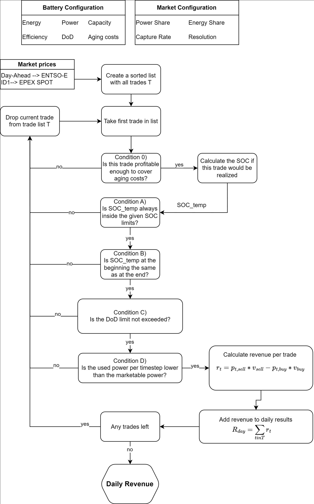

# Wholesale Trading

This section outlines a simplified approach to calculate revenues from index price infrmation from wholesale markets. This includes the Day-Ahead market (DA), Intraday Auctions (IDA1), and simpliefied Intraday Continuous (ID1).

The Day-Ahead (DA) and Intraday Auction (IDA1) markets are closed auction-based mechanisms that take place on the day before the physical delivery of electricity. Participants submit their bids and offers, and the market is cleared at a single price point for each hour, based on the intersection of supply and demand. These prices are firm and represent actual tradable values that market participants can rely on for scheduling generation or consumption.

The Intraday Continuous (ID1) market operates differently. Rather than having set auction times, ID1 enables continuous trading of electricity contracts right up until shortly before delivery. The ID1 index reflects the volume-weighted average price of all transactions that occur within the final hour of trading for a specific delivery period. This index serves to streamline the process of continuous intraday trading, whereby bids and asks are matched on a second-by-second basis.

### Revenue Calculation

Now we will calculate the daily revenue for the markets. The general idea here is to calculate the best trading profile based on the available price spread on each day.

For each trade, it is assumed that the full marketable power is used. The marketable power depends on the available nominal power of the battery and the allowed DoD given in the battery configuration.

$$P_t = \min\left(\frac{DoD \cdot E_{\text{nom}}}{t_{\text{market}}}, P_{\text{nom}}\right)$$

Then, the traded energy for the market is calculated for both buying and selling as:

*   $$E_{\text{buy}} = \frac{P_{(t_{\text{buy}})} \cdot \Delta t_{\text{market}}}{\eta_{\text{Bat}}}$$
*   $$E_{\text{sell}} = P_{(t_{\text{sell}})} \cdot \Delta t_{\text{market}} \cdot \eta_{\text{Bat}}$$

The State of Charge (SOC) in the battery is also calculated for buying and selling:

*   Buying: $$\Delta SOC_t = \frac{P_{(t_{\text{buy}})} \cdot \Delta t_{\text{market}}}{E_{\text{bat}}}$$
*   Selling: $$\Delta SOC_t = \frac{-P_{(t_{\text{sell}})} \cdot \Delta t_{\text{market}}}{E_{\text{bat}}}$$

As shown in the flowchart below, the code iterates through all possible trades in descending order based on the available price spread. For the single market results, the first available trade is always taken as no conflicts with other battery activity can occur. Then, iterating through the trade list, a virtual SOC profile is calculated, that would apply if that trade would be executed.

Then, we check multiple conditions that have to be fulfilled to make sure we only execute feasible trades without exceeding constraints from the given battery configuration.

These conditions are:

1.  Is the profit (in €/MWh) from this trade large enough to cover the aging costs of the battery?

    The aging costs are calculated simply by dividing the battery costs by the service life. Both parameters are given in the battery configuration.

    $$c_{\text{aging}} = \frac{c_{\text{bat}}}{\text{life}_{\text{Bat}} \cdot \text{cycles}_{\text{day}} \cdot 365}$$

2.  Does the SOC always stay within the given limits?

    $$SOC_t = SOC_{(t-1)} + \Delta SOC_t + SOC_t^{\text{fixed}} - SOC_{(t-1)}^{\text{fixed}}$$

    $$\min SOC \leq SOC \leq \max SOC$$

    The equation represents how the state of charge (SOC) of a battery is updated over time. It calculates the new SOC at time 𝑡 based on the previous SOC and the change in charge, while considering any fixed adjustments. The constraint ensures that the SOC always stays within a specified range, from a minimum to a maximum value.

3.  Is the SOC at the beginning of the day the same as at the end?

    This condition acts as a feasibility check that every opened trade is also closed in the end.

4.  Is the given maximum allowed DoD not exceeded?

    By calculating the SOC changes between each time step, we only allow this trade if the maximum DoD is not exceeded.

5.  Does this trade not exceed the maximum marketable power for the battery and this market?

    Finally, based on the calculated SOC curve, the SOC changes in the profile are calculated. These are then converted into power values.

    $$\Delta P = \frac{\text{diff}(SOC_t) \cdot E_{\text{bat}}}{\Delta t_{\text{market}}}$$

    We then check that the absolute power usage never exceeds the marketable power

    $$\Delta P \leq P_t$$

When all conditions are fulfilled, the trade is executed, and the revenue through this trade is added to the daily revenue.

### Revenue Formula:

The revenue is the difference between the product of discharged energy and the wholesale market price during the time of the sell $t_{\text{sell}}$ and the product of charged energy and price at the time of the buy side of the trade $t_{\text{buy}}$. The battery efficiency η is used in the revenue calculation to consider efficiency losses.

$$R_{\text{day}} += p_{(t_{\text{sell}})} \cdot P_{(t_{\text{sell}})} \cdot \Delta t_{\text{market}} \cdot \eta_{\text{Bat}} - p_{(t_{\text{buy}})} \cdot P_{(t_{\text{buy}})} \cdot \Delta t_{\text{market}} \cdot \frac{1}{\eta_{\text{Bat}}}$$

Finally, the revenue for this day is weighted with the given capture rate from the market configuration $cr^{\text{market}}$ to consider non-ideal trading.

$$R_{day}^{market}=cr^{market} \cdot R_{day}$$

    

### Market Details

| Market | Product Duration | Source | Description |
|----------|----------|----------|----------|
| **Day-Ahead**    | 1 hour     | ENTSO-E     | Bidding zone DE-LU     |
| **IDA1**    | 15 minutes     | EPEX Spot     | Regarded as the Intraday auction held at 3 PM on the day before deliver     |
| **ID1**    | 15 minutes     | EPEX Spot     | Market area DE-LU. Weighted average price of all continuous trades executed within the last trading hour of a contract.     |

